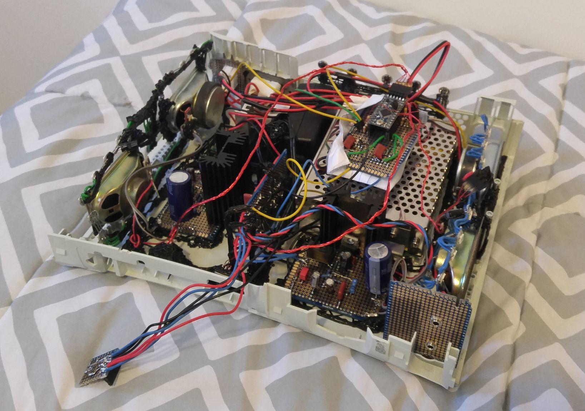

# Audio-Visual-MSGEQ7

<b>Beat detection algorithms (PDF)</b>\
This covers some approaches to detecting beats in music. The first approach is modified and used in 'MSGEQ7_BeatDetection_SerialOut.'

<b>MSGEQ7_BeatDetection_SerialOut</b>\
An Arduino (in my case, ProMini) is connected to an MSGEQ7, which is connected to an audio signal.\
The Arduino strobes through the seven bands of the MSGEQ7 and reads each output. The Arduino is running a beat detection algorithm, and sends seven comma separated values (one per audio band) over USB serial at 115200 baud.\
The algorithm is more or less a low-pass filter, modified to tend toward zero with no beats present, and allow the 'level' of a beat to pass through un-filtered.

<b>MSGEQ7_BeatDetection_Visualizer</b>\
This program (Processing) expects 7 comma separated integers coming over USB serial (COM3) at 115200 baud. It uses the seven values to control the color (brightness) of seven on-screen rectangles.  
  
<b>MSGEQ7_BeatDetection_With_LEDs_V2.1</b>  
Arduino code to read two MSGEQ7's, one for the left audio channel and one for the right, do beat detection on each, and drive LEDs according to the measurements.  

#### A demo  
Using the song [Drums Over London by Disco Zombies (CC BY-NC-ND 3.0)](https://freemusicarchive.org/music/Disco_Zombies/Drums_Over_London/06_Drums_Over_London/)  

https://github.com/D-Winker/Audio-Visual-MSGEQ7-/assets/18094417/ffc4ab8b-66e3-4304-a2d0-38201617ca6f
  
#### The hardware  
An Arduino dev board, a regulator for the Arduino, two analog power amps, some speakers from a broken TV, a bunch of WS2812 LEDs, and two power supplies - because that was the easiest way to keep the LED's PWM noise out of the speakers, all shoved into the shell of a broken XBOX360.   
  
  
  
#### The completed hardware playing the beginning of The River by King Gizzard and the Lizard Wizard  
  
   
  

